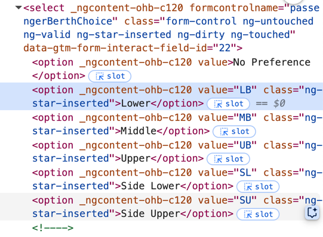
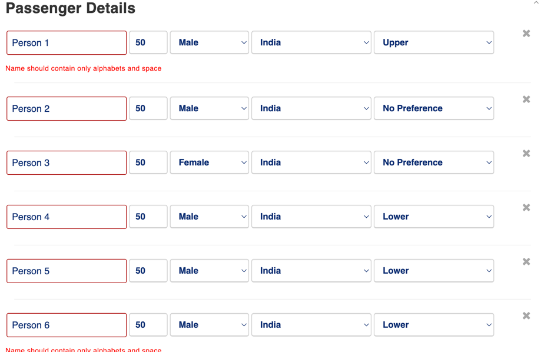

# Passenger Details Filling Script for IRCTC website ticket booking

### Background

I was booking for 6 people at once on irctc, usually till date had filled max 1 or 2 passenger from family,
and that too comes auto selected since I have saved them in my master list
now when  filling passenger details at once of 6 people it was time consuming on the IRCTC website, and we all know
time is so crucial while indian train ticket booking 

### Problem Statement

how can we reduce time to fill all the passenger details , some javascript magic so that just by 1 click 
all passenger details are filled, the problem might not be when we have already filled the passenger details, 
**but sometimes it gets removed or last minute logout if happens**

### Solution

To automate this process, I wrote simple JavaScript code:

1. Accepts an array of passenger details.
2. Automatically sets default values for fields which we want to be default values like Nationality we want always to be IN

### Passenger Details Code

```javascript
const passengers = [
    {
        name: "Person 1",
        age: 50,
        gender: "M",
        berth: "UB",
    },
    {
        name: "Person 2",
        age: 50,
        gender: "M",
    },
    {
        name: "Person 3",
        age: 50,
        gender: "F",
    },
    {
        name: "Person 4",
        age: 50,
        gender: "M",
    },
    {
        name: "Person 5",
        age: 50,
        gender: "M",
        berth: "LB",
    },
    {
        name: "Person 6",
        age: 50,
        gender: "M",
        berth: "LB",
    },
];
```

how did I determine the berth value   ```berth: "LB"```, 

so all the select tag have options with their value attribute, referenced same to create by passengers info Array

so berth can have values ```"LB", "MB", "UB", "SL", "SU"```

gender will have ```"M`, "F", "T"```
### Here comes the javascript magic

1. based on passengers count create input fields, by default ircts shows only 1 passenger details field
2. get all the fields to be updated
3. update their values with the passengers info array

```javascript
function fillAllPassengerForms(passengerArray) {
    function setSelectValue(selectEl, value) {
        if (!selectEl || !value) return;
        selectEl.value = value;
        selectEl.dispatchEvent(new Event("change", { bubbles: true }));
    }

    function updateBerthSelect(berthSelectEl, value) {
        if (!berthSelectEl || !value) return;

        berthSelectEl.value = value;
        berthSelectEl.classList.add("ng-dirty", "ng-touched");
        berthSelectEl.dispatchEvent(new Event("input", { bubbles: true }));
        berthSelectEl.dispatchEvent(new Event("change", { bubbles: true }));
    }

    const spanEleToAddPassenger = Array.from(
        document.querySelectorAll("span"),
    ).find((spanEl) => spanEl.textContent === "+ Add Passenger");

    // Add additional passenger forms except the first one
    for (let i = 0; i < passengerArray.length - 1; i++) {
        spanEleToAddPassenger.click();
    }
    // select all the elements
    const nameInputs = document.querySelectorAll(
        'p-autocomplete input[placeholder="Name"]',
    );
    const ageInputs = document.querySelectorAll(
        'input[formcontrolname="passengerAge"]',
    );
    const genderSelects = document.querySelectorAll(
        'select[formcontrolname="passengerGender"]',
    );
    const nationalitySelects = document.querySelectorAll(
        'select[formcontrolname="passengerNationality"]',
    );
    const berthSelects = document.querySelectorAll(
        'select[formcontrolname="passengerBerthChoice"]',
    );

    passengerArray.forEach((passenger, index) => {
        // change fields only which are provided in the passengers array
        // hence added passenger.field check
        if (nameInputs[index] && passenger.name) {
            nameInputs[index].value = passenger.name;
            nameInputs[index].dispatchEvent(new Event("input", { bubbles: true }));
        }

        if (ageInputs[index] && passenger.age) {
            ageInputs[index].value = passenger.age;
            ageInputs[index].dispatchEvent(new Event("input", { bubbles: true }));
        }

        if (genderSelects[index] && passenger.gender) {
            setSelectValue(genderSelects[index], passenger.gender);
        }

        if (nationalitySelects[index] && passenger.nationality) {
            setSelectValue(nationalitySelects[index], passenger.nationality);
        }

        if (berthSelects[index] && passenger.berth) {
            updateBerthSelect(berthSelects[index], passenger.berth);
        }
    });
}

const passengers = [
    {
        name: "Person 1",
        age: 50,
        gender: "M",
        berth: "UB",
    },
    {
        name: "Person 2",
        age: 50,
        gender: "M",
    },
    {
        name: "Person 3",
        age: 50,
        gender: "F",
    },
    {
        name: "Person 4",
        age: 50,
        gender: "M",
    },
    {
        name: "Person 5",
        age: 50,
        gender: "M",
        berth: "LB",
    },
    {
        name: "Person 6",
        age: 50,
        gender: "M",
        berth: "LB",
    },
];
fillAllPassengerForms(passengers);
// if we want to automate the click button also, add below snippet
Array.from(document.querySelectorAll('button[type="submit"]'))
    .find(
        (btnWithTypeSubmit) => btnWithTypeSubmit.textContent.trim() === "Continue",
    )
    .click();
```
If we run above code

above output will come just by running the script in browser console, or in source tab create  a snippet.

### Key Features

- **Automatic Fallbacks:** Automatically sets the fields to their default values if not provided like **nationality** to IN **berth** to No Preference.

### Next Steps

- tried to automate captcha , but since captcha is inside a image so reading the value from image was difficult
- payment method can also be configurable 

### Conclusion

This approach significantly reduced my time spent on manually filling passenger details and minimized errors during the booking process.

